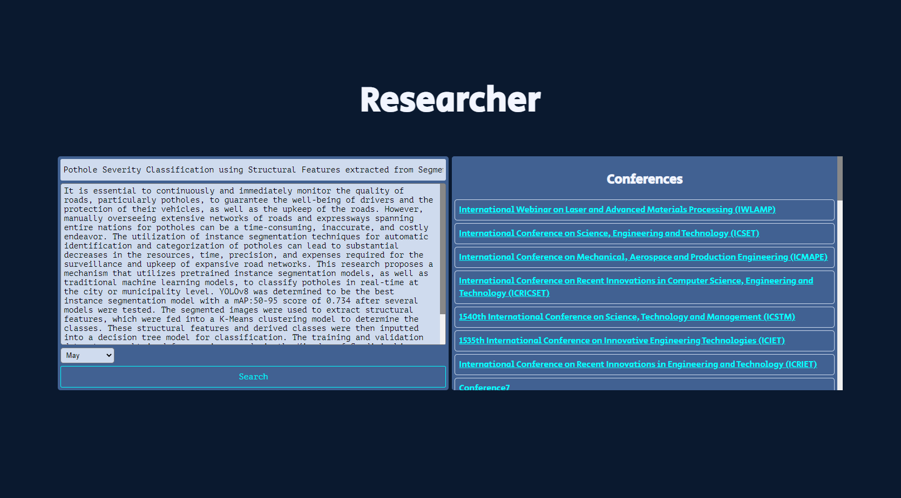

# Academic Conference Recommendation Engine

The Academic Conference Recommendation Engine is a web-based application that utilizes Natural Language Processing (NLP) techniques to recommend suitable academic conferences for research papers. The application allows users to input the title and abstract of their paper, and based on this input, the system determines the category of the paper using a logistic regression classifier in an OVR (One-vs-Rest) configuration. The backend then scrapes relevant websites to generate a list of conferences where users can apply.

### Screenshot 
